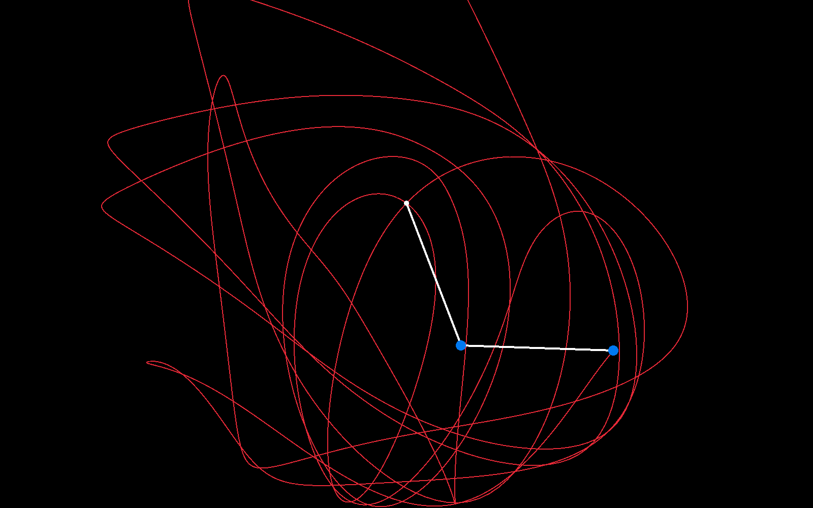

# Double Pendulum Simulation (C++ / Raylib)
A high-performance physical simulation of a double pendulum, developed in C++ using the Raylib library. This project demonstrates the phenomenon of deterministic chaos, where a simple set of initial conditions leads to a complex and unpredictable trajectory.
🚀 Features

    Real-time Physics: Solving Lagrangian equations of motion every frame.

    Dynamic Trace: A circular buffer-based trajectory visualizer that tracks the path of the second mass without performance degradation.

    Modular Frame Recorder: An integrated utility to capture high-quality frames for video export.

    Parameter Customization: Easily adjustable mass, rod length, and gravity constants.

    Stability Control: Optional energy loss (damping) to compensate for numerical integration drift.

🛠️ Technologies

    Language: C++11 or higher.

    Graphics Library: Raylib.

    Physics Engine: Lagrangian mechanics (Numerical integration via Euler method).

📸 Demonstration
    

📋 How to Build and Run
Prerequisites

    A C++ compiler (GCC, Clang, or MSVC).

    Raylib installed on your system.

Compilation (Linux/MacOS example)
Bash

g++ main.cpp -lraylib -lGL -lm -lpthread -ldl -lrt -lX11 -o double_pendulum
./double_pendulum

🧠 The Physics

The system is governed by a pair of coupled second-order differential equations. Unlike a single pendulum, the double pendulum has no simple analytical solution and must be solved numerically to find the angular accelerations α1​ and α2​:
🎮 Controls

    R: Start recording frames (outputs a sequence of PNG files).

    S: Take a single screenshot.

    ESC: Close the simulation.

    The "About" section: On the right side of your GitHub repo, add tags like #physics, #cpp, #raylib, and #chaos-theory to help people find your project.

    Images: If you want to include the actual math formulas, you can use a LaTeX-to-PNG generator or take a clean screenshot of the formulas and host them in your screenshots folder.
